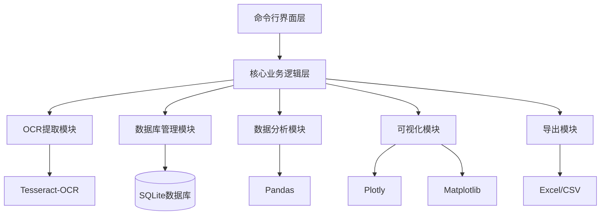
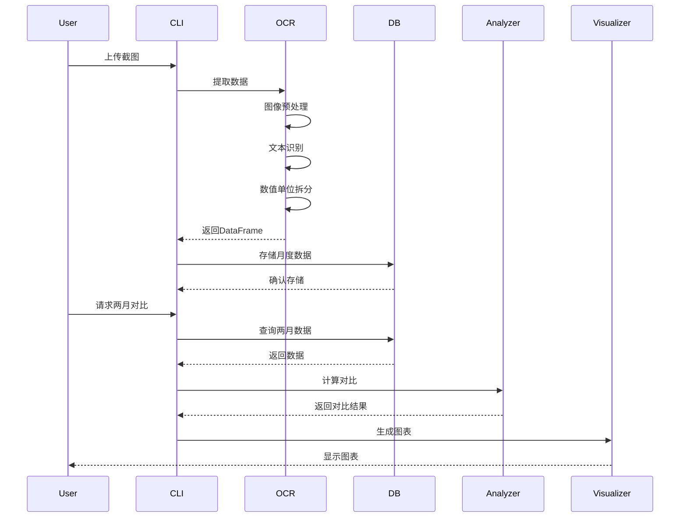

# 设计文档

## 概述

发射机数据分析器是一个跨平台的Python命令行工具，用于自动化处理发射机监控系统的截图数据。系统采用模块化架构，将数据提取、存储、分析和可视化功能解耦，确保代码的可维护性和可扩展性。

核心工作流程：
1. 使用OCR技术从截图中提取表格数据
2. 将数据结构化并存储到SQLite数据库
3. 提供月度数据对比和趋势分析功能
4. 生成交互式和静态可视化图表
5. 支持数据导出和管理

技术栈：Python 3.8+、pytesseract、pandas、SQLite、matplotlib、plotly、pathlib

## 架构

系统采用分层架构设计：



### 架构层次说明

1. **命令行界面层（CLI Layer）**
   - 负责用户交互和输入验证
   - 提供菜单驱动的操作界面
   - 处理用户输入并调用核心业务逻辑

2. **核心业务逻辑层（Core Business Logic Layer）**
   - 协调各个功能模块
   - 实现业务流程编排
   - 处理异常和错误恢复

3. **功能模块层（Functional Modules Layer）**
   - OCR提取模块：图像预处理和文本识别
   - 数据库管理模块：数据持久化和查询
   - 数据分析模块：对比计算和统计分析
   - 可视化模块：图表生成和渲染
   - 导出模块：数据格式转换和文件输出

## 组件和接口

### 1. OCR提取模块（ocr_extractor.py）

**职责：** 从截图中提取结构化数据

**核心类：**

```python
class OCRExtractor:
    """OCR数据提取器"""
    
    def __init__(self, tesseract_path: Optional[str] = None):
        """
        初始化OCR提取器
        
        Args:
            tesseract_path: Tesseract可执行文件路径（可选，自动检测）
        """
        pass
    
    def extract_from_image(self, image_path: Path) -> pd.DataFrame:
        """
        从图像中提取表格数据
        
        Args:
            image_path: 图像文件路径
            
        Returns:
            包含item_name、value、unit三列的DataFrame
            
        Raises:
            FileNotFoundError: 图像文件不存在
            OCRError: OCR识别失败
        """
        pass
    
    def _preprocess_image(self, image: np.ndarray) -> np.ndarray:
        """
        图像预处理（二值化、降噪）
        
        Args:
            image: 原始图像数组
            
        Returns:
            预处理后的图像数组
        """
        pass
    
    def _parse_value_unit(self, text: str) -> Tuple[float, str]:
        """
        解析带单位的数值字符串
        
        Args:
            text: 原始文本（如"12.5V"、"407%"）
            
        Returns:
            (数值, 单位)元组
            
        Examples:
            "12.5V" -> (12.5, "V")
            "407%" -> (407.0, "%")
            "28" -> (28.0, "")
        """
        pass
```

**关键算法：**

1. **图像预处理流程：**
   - 灰度化转换
   - 自适应阈值二值化
   - 形态学操作去除网格线（可选）

2. **表格结构识别：**
   - 使用pytesseract的`image_to_data`获取文本位置信息
   - 根据坐标信息重建表格结构
   - 按行列关系组织数据

3. **数值单位拆分：**
   - 使用正则表达式匹配数值和单位
   - 支持的单位：V（电压）、A（电流）、W（功率）、°C（温度）、%（百分比）等
   - 处理无单位的纯数字

### 2. 数据库管理模块（database.py）

**职责：** 数据持久化和查询管理

**核心类：**

```python
class TransmitterDatabase:
    """发射机数据库管理器"""
    
    def __init__(self, db_path: Optional[Path] = None):
        """
        初始化数据库连接
        
        Args:
            db_path: 数据库文件路径（可选，使用默认路径）
        """
        pass
    
    def initialize_database(self) -> None:
        """创建数据库表结构"""
        pass
    
    def insert_monthly_data(
        self, 
        month: str, 
        data: pd.DataFrame,
        overwrite: bool = False
    ) -> None:
        """
        插入月度数据
        
        Args:
            month: 月份字符串（YYYY-MM格式）
            data: 包含item_name、value、unit的DataFrame
            overwrite: 是否覆盖已存在的数据
            
        Raises:
            ValueError: 月份格式错误
            DataExistsError: 数据已存在且overwrite=False
        """
        pass
    
    def query_by_month(self, month: str) -> pd.DataFrame:
        """
        查询指定月份的所有数据
        
        Args:
            month: 月份字符串（YYYY-MM格式）
            
        Returns:
            包含完整数据的DataFrame
        """
        pass
    
    def query_by_item(self, item_name: str) -> pd.DataFrame:
        """
        查询指定数据项的历史记录
        
        Args:
            item_name: 数据项名称
            
        Returns:
            包含该数据项所有月份记录的DataFrame
        """
        pass
    
    def delete_month(self, month: str) -> int:
        """
        删除指定月份的数据
        
        Args:
            month: 月份字符串
            
        Returns:
            删除的记录数
        """
        pass
    
    def get_available_months(self) -> List[str]:
        """
        获取数据库中所有可用月份
        
        Returns:
            月份列表（按时间排序）
        """
        pass
    
    def get_all_items(self) -> List[str]:
        """
        获取所有数据项名称
        
        Returns:
            数据项名称列表
        """
        pass
```

**数据库表结构：**

```sql
CREATE TABLE IF NOT EXISTS transmitter_data (
    id INTEGER PRIMARY KEY AUTOINCREMENT,
    month TEXT NOT NULL,
    item_name TEXT NOT NULL,
    value REAL NOT NULL,
    unit TEXT,
    create_time TIMESTAMP DEFAULT CURRENT_TIMESTAMP,
    UNIQUE(month, item_name)
);

CREATE INDEX idx_month ON transmitter_data(month);
CREATE INDEX idx_item_name ON transmitter_data(item_name);
```

**跨平台路径处理：**

```python
def get_default_db_path() -> Path:
    """
    获取默认数据库路径
    
    Returns:
        Mac: ~/Documents/transmitter_data.db
        Windows: C:/Users/用户名/Documents/transmitter_data.db
    """
    home = Path.home()
    documents = home / "Documents"
    documents.mkdir(exist_ok=True)
    return documents / "transmitter_data.db"
```

### 3. 数据分析模块（analyzer.py）

**职责：** 数据对比和统计分析

**核心类：**

```python
class DataAnalyzer:
    """数据分析器"""
    
    def __init__(self, database: TransmitterDatabase):
        """
        初始化分析器
        
        Args:
            database: 数据库管理器实例
        """
        pass
    
    def compare_two_months(
        self, 
        month1: str, 
        month2: str
    ) -> pd.DataFrame:
        """
        对比两个月的数据
        
        Args:
            month1: 第一个月份（较早）
            month2: 第二个月份（较晚）
            
        Returns:
            包含以下列的DataFrame：
            - item_name: 数据项名称
            - value_month1: 第一个月的数值
            - value_month2: 第二个月的数值
            - unit: 单位
            - absolute_change: 绝对变化量（month2 - month1）
            - relative_change: 相对变化率（百分比）
            - change_status: 变化状态（'increase', 'decrease', 'no_change'）
        """
        pass
    
    def calculate_statistics(
        self, 
        item_name: str,
        start_month: Optional[str] = None,
        end_month: Optional[str] = None
    ) -> Dict[str, float]:
        """
        计算数据项的统计指标
        
        Args:
            item_name: 数据项名称
            start_month: 起始月份（可选）
            end_month: 结束月份（可选）
            
        Returns:
            包含mean、std、min、max、median等统计指标的字典
        """
        pass
    
    def detect_anomalies(
        self,
        item_name: str,
        threshold: float = 2.0
    ) -> List[Tuple[str, float]]:
        """
        检测异常值（基于标准差）
        
        Args:
            item_name: 数据项名称
            threshold: 异常阈值（标准差倍数）
            
        Returns:
            异常值列表：[(月份, 数值), ...]
        """
        pass
```

**对比算法：**

```python
def _calculate_changes(df1: pd.DataFrame, df2: pd.DataFrame) -> pd.DataFrame:
    """
    计算变化量和变化率
    
    算法：
    1. 按item_name进行内连接（只保留两月都存在的数据项）
    2. 计算绝对变化量：absolute_change = value2 - value1
    3. 计算相对变化率：relative_change = (value2 - value1) / value1 * 100
    4. 确定变化状态：
       - absolute_change > 0.01: 'increase'
       - absolute_change < -0.01: 'decrease'
       - 其他: 'no_change'
    """
    pass
```

### 4. 可视化模块（visualizer.py）

**职责：** 生成交互式和静态图表

**核心类：**

```python
class DataVisualizer:
    """数据可视化器"""
    
    def __init__(self, database: TransmitterDatabase):
        """
        初始化可视化器
        
        Args:
            database: 数据库管理器实例
        """
        pass
    
    def plot_comparison_chart(
        self,
        comparison_df: pd.DataFrame,
        output_path: Optional[Path] = None
    ) -> None:
        """
        绘制两月对比柱状图
        
        Args:
            comparison_df: 对比数据DataFrame
            output_path: 输出文件路径（可选）
            
        图表特性：
        - 并排柱状图展示两月数值
        - 有变化的柱子标注变化量和变化率
        - 使用颜色区分变化状态（红色=增长，绿色=下降，灰色=无变化）
        """
        pass
    
    def plot_trend_chart(
        self,
        item_names: List[str],
        start_month: Optional[str] = None,
        end_month: Optional[str] = None,
        threshold: Optional[float] = None,
        output_path: Optional[Path] = None,
        interactive: bool = True
    ) -> None:
        """
        绘制月度趋势折线图
        
        Args:
            item_names: 数据项名称列表
            start_month: 起始月份（可选）
            end_month: 结束月份（可选）
            threshold: 阈值线（可选）
            output_path: 输出文件路径（可选）
            interactive: 是否使用plotly生成交互图表
            
        图表特性：
        - 每个数据项一条折线
        - 数据点标注"月份+数值"
        - 超过阈值的点标红
        - 支持交互式缩放和悬停
        """
        pass
    
    def plot_category_trends(
        self,
        category: str,
        output_path: Optional[Path] = None
    ) -> None:
        """
        按模块分类绘制趋势图
        
        Args:
            category: 模块类别（'power', 'temperature', 'voltage'等）
            output_path: 输出文件路径（可选）
            
        实现：
        - 根据数据项名称关键词自动分类
        - 在同一图表中展示同类数据项
        """
        pass
```

**可视化样式配置：**

```python
# 工业数据可视化风格
STYLE_CONFIG = {
    'figure_size': (12, 6),
    'dpi': 100,
    'font_family': 'sans-serif',
    'title_size': 14,
    'label_size': 12,
    'tick_size': 10,
    'line_width': 2,
    'marker_size': 8,
    'color_increase': '#FF4444',  # 红色
    'color_decrease': '#44FF44',  # 绿色
    'color_no_change': '#CCCCCC',  # 灰色
    'color_threshold': '#FF8800',  # 橙色
    'grid_alpha': 0.3
}
```

### 5. 导出模块（exporter.py）

**职责：** 数据格式转换和文件导出

**核心类：**

```python
class DataExporter:
    """数据导出器"""
    
    def export_to_excel(
        self,
        data: pd.DataFrame,
        output_path: Path,
        sheet_name: str = 'Data'
    ) -> None:
        """
        导出数据到Excel文件
        
        Args:
            data: 要导出的DataFrame
            output_path: 输出文件路径
            sheet_name: 工作表名称
        """
        pass
    
    def export_to_csv(
        self,
        data: pd.DataFrame,
        output_path: Path
    ) -> None:
        """
        导出数据到CSV文件
        
        Args:
            data: 要导出的DataFrame
            output_path: 输出文件路径
        """
        pass
    
    def export_comparison_report(
        self,
        comparison_df: pd.DataFrame,
        output_path: Path
    ) -> None:
        """
        导出格式化的对比报告（Excel）
        
        Args:
            comparison_df: 对比数据DataFrame
            output_path: 输出文件路径
            
        特性：
        - 应用条件格式（增长=红色，下降=绿色）
        - 自动调整列宽
        - 添加标题和说明
        """
        pass
```

### 6. 命令行界面（cli.py）

**职责：** 用户交互和流程控制

**核心类：**

```python
class TransmitterCLI:
    """命令行界面"""
    
    def __init__(self):
        """初始化CLI和所有模块"""
        pass
    
    def run(self) -> None:
        """运行主循环"""
        pass
    
    def show_main_menu(self) -> None:
        """显示主菜单"""
        pass
    
    def handle_data_entry(self) -> None:
        """处理数据录入流程"""
        pass
    
    def handle_comparison(self) -> None:
        """处理两月对比流程"""
        pass
    
    def handle_trend_visualization(self) -> None:
        """处理趋势可视化流程"""
        pass
    
    def handle_data_management(self) -> None:
        """处理数据管理流程"""
        pass
```

**菜单结构：**

```
主菜单：
1. 录入数据
2. 两月对比
3. 绘制趋势
4. 数据管理
5. 退出

数据管理子菜单：
1. 查询月度数据
2. 查询数据项历史
3. 删除月度数据
4. 导出数据
5. 返回主菜单
```

## 数据模型

### 核心数据结构

**1. 提取数据（ExtractedData）**

```python
@dataclass
class ExtractedData:
    """OCR提取的原始数据"""
    item_name: str      # 数据项名称
    value: float        # 数值
    unit: str           # 单位
    confidence: float   # OCR置信度（0-1）
```

**2. 月度记录（MonthlyRecord）**

```python
@dataclass
class MonthlyRecord:
    """月度数据记录"""
    id: int
    month: str          # YYYY-MM格式
    item_name: str
    value: float
    unit: str
    create_time: datetime
```

**3. 对比结果（ComparisonResult）**

```python
@dataclass
class ComparisonResult:
    """两月对比结果"""
    item_name: str
    value_month1: float
    value_month2: float
    unit: str
    absolute_change: float
    relative_change: float  # 百分比
    change_status: str      # 'increase', 'decrease', 'no_change'
```

### 数据流转



## 正确性属性

*属性是关于系统应该做什么的特征或行为的正式陈述，它应该在系统的所有有效执行中保持为真。属性是人类可读规范和机器可验证正确性保证之间的桥梁。*


### 属性 1: 数值单位拆分正确性
*对于任何* 带单位的数值字符串（如"12.5V"、"407%"、"28°C"），解析函数应该正确拆分为数值和单位两部分，且数值部分为有效的浮点数。

**验证：需求 1.2**

### 属性 2: 提取数据结构完整性
*对于任何* OCR提取操作，返回的DataFrame应该包含item_name、value、unit三个字段，且所有字段均不为空（除非整个提取失败）。

**验证：需求 1.3, 3.4**

### 属性 3: 错误输入处理
*对于任何* 无效的输入（不存在的文件路径、不支持的图像格式、错误的月份格式），系统应该抛出明确的异常或返回错误信息，而不是崩溃或返回不正确的结果。

**验证：需求 1.4, 2.5, 8.3, 8.4**

### 属性 4: 跨平台路径检测
*对于任何* 操作系统（Mac或Windows），系统应该能够自动检测并使用正确的默认数据库路径和Tesseract路径。

**验证：需求 2.4**

### 属性 5: 月份格式验证
*对于任何* 月份字符串输入，系统应该验证其是否符合YYYY-MM格式，不符合则拒绝并提示正确格式。

**验证：需求 3.2**

### 属性 6: 重复数据处理
*对于任何* 已存在月份的数据插入操作，系统应该检测到重复并提示用户选择覆盖或取消，而不是静默覆盖或创建重复记录。

**验证：需求 3.3**

### 属性 7: 时间戳记录不变性
*对于任何* 插入到数据库的记录，都应该自动包含create_time时间戳字段，且该字段不为空。

**验证：需求 3.5**

### 属性 8: 查询结果正确性
*对于任何* 有效的查询条件（月份或数据项名称），查询应该返回且仅返回满足条件的所有记录；对于不存在的查询条件，应该返回空结果。

**验证：需求 4.1, 4.2, 4.5**

### 属性 9: 删除操作完整性
*对于任何* 月份的删除操作，该月份的所有记录都应该被移除，且删除后查询该月份应该返回空结果。

**验证：需求 4.3**

### 属性 10: 数据项匹配正确性
*对于任意* 两个月份的对比操作，系统应该按数据项名称匹配数据，只对比两月都存在的数据项，并正确识别缺失项。

**验证：需求 5.1, 5.6**

### 属性 11: 变化量计算正确性
*对于任何* 匹配成功的数据项对，绝对变化量应该等于（后值 - 前值），相对变化率应该等于（(后值 - 前值) / 前值 × 100%）。

**验证：需求 5.2**

### 属性 12: 导出功能完整性
*对于任何* 数据集（月度数据、对比结果、趋势数据），导出操作应该生成包含所有数据的有效文件（Excel、CSV或图像格式），且文件可以被相应的程序正确打开。

**验证：需求 4.4, 5.5, 6.5**

### 属性 13: 数据项分类正确性
*对于任何* 数据项名称，分类函数应该根据关键词（如"voltage"、"temperature"、"power"）将其归类到正确的模块类别。

**验证：需求 6.4**

### 属性 14: 无效输入菜单处理
*对于任何* 不在菜单选项范围内的用户输入，系统应该提示错误并重新显示菜单，而不是执行错误操作或崩溃。

**验证：需求 7.6**

### 属性 15: 部分失败容错性
*对于任何* 包含部分无效数据的提取操作，系统应该处理有效部分并记录警告，而不是因为部分失败而完全失败。

**验证：需求 8.1, 8.2**

### 属性 16: 异常日志记录
*对于任何* 系统异常，都应该在日志文件中记录详细信息（时间戳、错误类型、堆栈跟踪），以便后续排查。

**验证：需求 8.5**

### 属性 17: 依赖检测完整性
*对于任何* 必需的外部依赖（Tesseract-OCR、Python包），系统在首次运行时应该能够检测其是否安装，缺失则提供清晰的安装指引。

**验证：需求 9.3**

## 错误处理

### 错误分类

**1. 输入错误（Input Errors）**
- 文件不存在或无法访问
- 图像格式不支持
- 月份格式错误
- 无效的菜单选项

**处理策略：**
- 验证输入参数
- 返回清晰的错误消息
- 提供正确的输入示例
- 允许用户重新输入

**2. OCR错误（OCR Errors）**
- Tesseract未安装或路径错误
- 图像质量过低无法识别
- 表格结构无法解析

**处理策略：**
- 检测Tesseract安装状态
- 提供安装指引
- 记录识别失败的数据项
- 继续处理其他数据项

**3. 数据库错误（Database Errors）**
- 数据库文件损坏
- 权限不足无法写入
- 磁盘空间不足
- 数据完整性约束违反

**处理策略：**
- 捕获SQLite异常
- 提供数据库修复建议
- 建议用户检查权限和空间
- 提供备份恢复指引

**4. 数据错误（Data Errors）**
- 数值格式异常
- 数据项缺失
- 单位无法识别
- 月份数据不存在

**处理策略：**
- 尝试数据清洗和修复
- 记录无法处理的数据
- 提供部分结果
- 标注数据质量问题

### 错误处理实现

```python
class TransmitterError(Exception):
    """基础异常类"""
    pass

class OCRError(TransmitterError):
    """OCR相关错误"""
    pass

class DatabaseError(TransmitterError):
    """数据库相关错误"""
    pass

class DataValidationError(TransmitterError):
    """数据验证错误"""
    pass

class FileError(TransmitterError):
    """文件操作错误"""
    pass

# 错误处理装饰器
def handle_errors(func):
    """统一错误处理装饰器"""
    @wraps(func)
    def wrapper(*args, **kwargs):
        try:
            return func(*args, **kwargs)
        except FileNotFoundError as e:
            logger.error(f"文件未找到: {e}")
            raise FileError(f"文件不存在: {e.filename}")
        except sqlite3.Error as e:
            logger.error(f"数据库错误: {e}")
            raise DatabaseError(f"数据库操作失败: {str(e)}")
        except Exception as e:
            logger.exception(f"未预期的错误: {e}")
            raise TransmitterError(f"操作失败: {str(e)}")
    return wrapper
```

### 日志配置

```python
import logging
from pathlib import Path

def setup_logging():
    """配置日志系统"""
    log_dir = Path.home() / "Documents" / "transmitter_logs"
    log_dir.mkdir(exist_ok=True)
    
    log_file = log_dir / f"transmitter_{datetime.now():%Y%m%d}.log"
    
    logging.basicConfig(
        level=logging.INFO,
        format='%(asctime)s - %(name)s - %(levelname)s - %(message)s',
        handlers=[
            logging.FileHandler(log_file, encoding='utf-8'),
            logging.StreamHandler()
        ]
    )
    
    return logging.getLogger('transmitter')
```

## 测试策略

### 测试方法

系统采用**双重测试方法**：单元测试和基于属性的测试（Property-Based Testing）相结合。

**单元测试（Unit Tests）：**
- 验证特定示例和边界情况
- 测试集成点和组件交互
- 验证错误处理逻辑
- 使用pytest框架

**基于属性的测试（Property-Based Tests）：**
- 验证通用属性在所有输入下成立
- 通过随机生成大量测试用例
- 发现边界情况和异常输入
- 使用Hypothesis库
- 每个属性测试至少运行100次迭代

### 测试框架配置

**依赖包：**
```
pytest==7.4.0
pytest-cov==4.1.0
hypothesis==6.82.0
```

**pytest配置（pytest.ini）：**
```ini
[pytest]
testpaths = tests
python_files = test_*.py
python_classes = Test*
python_functions = test_*
addopts = 
    --verbose
    --cov=src
    --cov-report=html
    --cov-report=term-missing
```

**Hypothesis配置：**
```python
from hypothesis import settings, HealthCheck

# 全局配置
settings.register_profile("default", max_examples=100, deadline=None)
settings.load_profile("default")
```

### 测试用例组织

```
tests/
├── unit/
│   ├── test_ocr_extractor.py      # OCR提取单元测试
│   ├── test_database.py            # 数据库操作单元测试
│   ├── test_analyzer.py            # 数据分析单元测试
│   ├── test_visualizer.py          # 可视化单元测试
│   └── test_cli.py                 # CLI交互单元测试
├── property/
│   ├── test_properties_extraction.py   # 提取相关属性测试
│   ├── test_properties_database.py     # 数据库相关属性测试
│   ├── test_properties_analysis.py     # 分析相关属性测试
│   └── test_properties_validation.py   # 验证相关属性测试
├── integration/
│   ├── test_end_to_end.py          # 端到端集成测试
│   └── test_workflows.py           # 工作流集成测试
└── fixtures/
    ├── sample_images/              # 测试用截图
    ├── sample_data.py              # 模拟数据生成器
    └── conftest.py                 # pytest fixtures
```

### 属性测试示例

**属性 2: 提取数据结构完整性**

```python
from hypothesis import given, strategies as st
import pandas as pd

@given(
    item_names=st.lists(st.text(min_size=1), min_size=1, max_size=20),
    values=st.lists(st.floats(allow_nan=False, allow_infinity=False), min_size=1),
    units=st.lists(st.text(), min_size=1)
)
def test_property_extraction_data_structure(item_names, values, units):
    """
    Feature: transmitter-data-analyzer, Property 2: 提取数据结构完整性
    
    对于任何OCR提取操作，返回的DataFrame应该包含item_name、value、unit三个字段
    """
    # 创建模拟的提取结果
    extractor = OCRExtractor()
    
    # 假设我们有一个模拟的提取函数
    result_df = extractor._create_dataframe(item_names, values, units)
    
    # 验证DataFrame结构
    assert isinstance(result_df, pd.DataFrame)
    assert set(result_df.columns) == {'item_name', 'value', 'unit'}
    assert len(result_df) > 0
    assert result_df['item_name'].notna().all()
    assert result_df['value'].notna().all()
```

**属性 11: 变化量计算正确性**

```python
from hypothesis import given, strategies as st

@given(
    value1=st.floats(min_value=0.01, max_value=1000, allow_nan=False),
    value2=st.floats(min_value=0.01, max_value=1000, allow_nan=False)
)
def test_property_change_calculation(value1, value2):
    """
    Feature: transmitter-data-analyzer, Property 11: 变化量计算正确性
    
    对于任何匹配成功的数据项对，变化量计算应该正确
    """
    analyzer = DataAnalyzer(database=None)
    
    absolute_change = analyzer._calculate_absolute_change(value1, value2)
    relative_change = analyzer._calculate_relative_change(value1, value2)
    
    # 验证绝对变化量
    assert abs(absolute_change - (value2 - value1)) < 1e-6
    
    # 验证相对变化率
    expected_relative = ((value2 - value1) / value1) * 100
    assert abs(relative_change - expected_relative) < 1e-6
```

### 单元测试示例

**OCR提取测试：**

```python
def test_parse_value_unit_with_voltage():
    """测试电压单位解析"""
    extractor = OCRExtractor()
    value, unit = extractor._parse_value_unit("12.5V")
    assert value == 12.5
    assert unit == "V"

def test_parse_value_unit_with_percentage():
    """测试百分比单位解析"""
    extractor = OCRExtractor()
    value, unit = extractor._parse_value_unit("407%")
    assert value == 407.0
    assert unit == "%"

def test_parse_value_unit_without_unit():
    """测试无单位数值解析"""
    extractor = OCRExtractor()
    value, unit = extractor._parse_value_unit("28")
    assert value == 28.0
    assert unit == ""
```

**数据库测试：**

```python
def test_insert_and_query_monthly_data(tmp_path):
    """测试数据插入和查询"""
    db_path = tmp_path / "test.db"
    db = TransmitterDatabase(db_path)
    db.initialize_database()
    
    # 插入测试数据
    test_data = pd.DataFrame({
        'item_name': ['Voltage', 'Current'],
        'value': [12.5, 2.3],
        'unit': ['V', 'A']
    })
    db.insert_monthly_data('2026-01', test_data)
    
    # 查询并验证
    result = db.query_by_month('2026-01')
    assert len(result) == 2
    assert set(result['item_name']) == {'Voltage', 'Current'}
```

### 集成测试

**端到端工作流测试：**

```python
def test_complete_workflow(tmp_path):
    """测试完整的数据处理工作流"""
    # 1. 提取数据
    extractor = OCRExtractor()
    data = extractor.extract_from_image(Path("tests/fixtures/sample.png"))
    
    # 2. 存储数据
    db = TransmitterDatabase(tmp_path / "test.db")
    db.initialize_database()
    db.insert_monthly_data('2026-01', data)
    
    # 3. 对比分析
    db.insert_monthly_data('2026-02', data)  # 插入第二个月数据
    analyzer = DataAnalyzer(db)
    comparison = analyzer.compare_two_months('2026-01', '2026-02')
    
    # 4. 可视化
    visualizer = DataVisualizer(db)
    visualizer.plot_comparison_chart(comparison, tmp_path / "chart.png")
    
    # 验证
    assert (tmp_path / "chart.png").exists()
```

### 测试数据生成

**模拟数据生成器：**

```python
from hypothesis import strategies as st

# 数据项名称策略
item_name_strategy = st.sampled_from([
    'Forward Power', 'Reflected Power', 'PA Current', 'PA Voltage',
    'APC Volts', 'Airflow %', 'FM EXC Power %', 'Ambient Temp',
    'IPA AB Current', 'IPA AB Voltage', 'IPA AB Power'
])

# 数值策略（根据数据项类型）
value_strategy = st.floats(min_value=0.0, max_value=1000.0, allow_nan=False)

# 单位策略
unit_strategy = st.sampled_from(['V', 'A', 'W', '%', '°C', ''])

# 月份策略
month_strategy = st.dates(
    min_value=date(2020, 1, 1),
    max_value=date(2030, 12, 31)
).map(lambda d: d.strftime('%Y-%m'))

# 完整数据记录策略
data_record_strategy = st.builds(
    dict,
    item_name=item_name_strategy,
    value=value_strategy,
    unit=unit_strategy
)
```

### 测试覆盖率目标

- 代码覆盖率：≥ 80%
- 分支覆盖率：≥ 75%
- 核心模块覆盖率：≥ 90%（OCR、数据库、分析模块）

### 持续集成

建议使用GitHub Actions或类似CI工具自动运行测试：

```yaml
# .github/workflows/test.yml
name: Tests

on: [push, pull_request]

jobs:
  test:
    runs-on: ${{ matrix.os }}
    strategy:
      matrix:
        os: [ubuntu-latest, macos-latest, windows-latest]
        python-version: [3.8, 3.9, 3.10, 3.11]
    
    steps:
    - uses: actions/checkout@v3
    - name: Set up Python
      uses: actions/setup-python@v4
      with:
        python-version: ${{ matrix.python-version }}
    - name: Install dependencies
      run: |
        pip install -r requirements.txt
        pip install -r requirements-dev.txt
    - name: Run tests
      run: pytest
```

## 实现注意事项

### 跨平台兼容性

1. **路径处理：** 始终使用`pathlib.Path`而不是字符串拼接
2. **Tesseract路径：** 提供自动检测和手动配置两种方式
3. **文件编码：** 明确指定UTF-8编码
4. **换行符：** 使用Python的通用换行模式

### 性能优化

1. **批量数据库操作：** 使用`executemany`而不是循环插入
2. **图像预处理：** 缓存预处理结果避免重复计算
3. **数据查询：** 使用索引优化查询性能
4. **可视化：** 对大数据集进行采样或分页显示

### 安全性

1. **SQL注入防护：** 使用参数化查询
2. **文件路径验证：** 防止路径遍历攻击
3. **输入验证：** 验证所有用户输入
4. **错误信息：** 避免泄露敏感系统信息

### 可维护性

1. **模块解耦：** 各模块通过接口交互，降低耦合度
2. **配置外部化：** 使用配置文件管理可变参数
3. **日志记录：** 记录关键操作和错误信息
4. **代码注释：** 为复杂逻辑提供清晰注释
