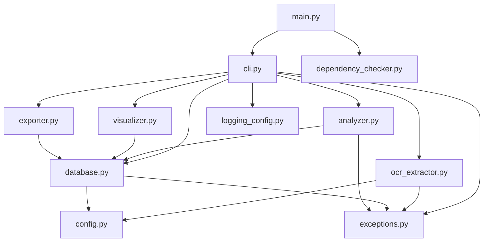
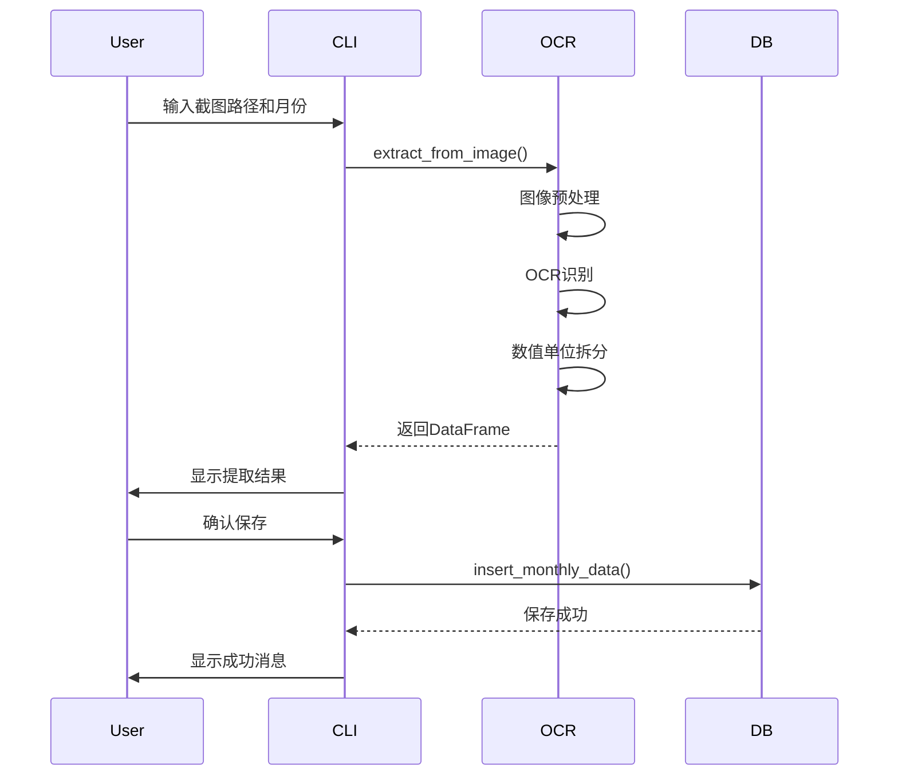
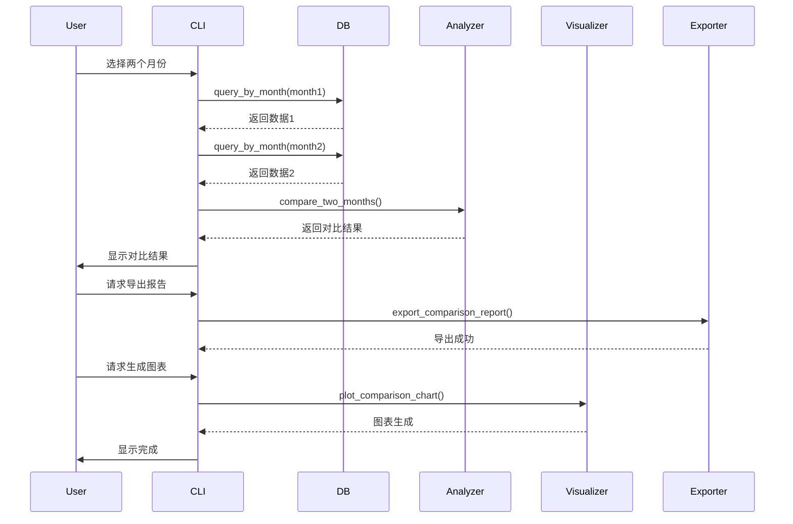
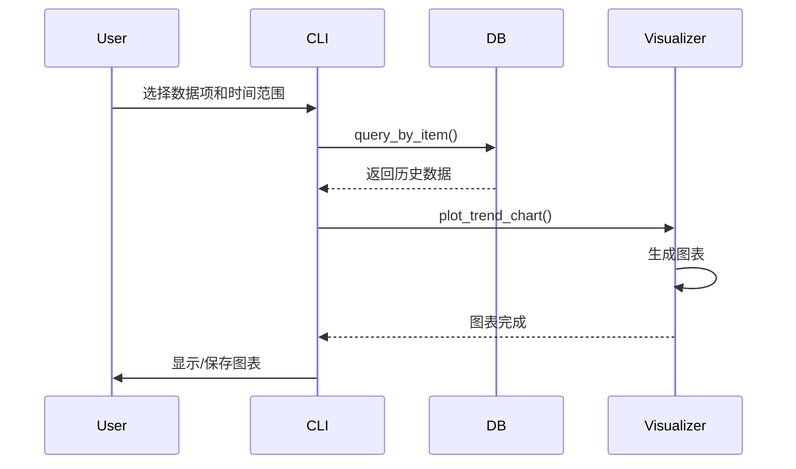

# 架构说明

本文档详细描述发射机数据分析器的系统架构、设计决策和实现细节。

## 目录

- [系统概述](#系统概述)
- [架构设计](#架构设计)
- [核心模块](#核心模块)
- [数据流](#数据流)
- [设计决策](#设计决策)
- [扩展性](#扩展性)

## 系统概述

### 项目目标

发射机数据分析器是一个跨平台的Python命令行工具，旨在：

1. 自动化发射机数据录入流程
2. 提供月度数据对比和趋势分析
3. 生成可视化报告
4. 支持数据导出和管理

### 技术栈

- **语言**: Python 3.8+
- **OCR引擎**: Tesseract-OCR + pytesseract
- **数据处理**: pandas, numpy
- **数据库**: SQLite3
- **可视化**: matplotlib (静态), plotly (交互式)
- **图像处理**: Pillow (PIL)
- **测试**: pytest, hypothesis
- **代码质量**: black, pylint, mypy

### 设计原则

1. **模块化**: 功能解耦，便于维护和扩展
2. **简洁性**: 避免过度设计，优先使用简单直观的实现
3. **跨平台**: 使用pathlib等跨平台库
4. **可测试性**: 所有核心功能都有测试覆盖
5. **用户友好**: 提供清晰的错误信息和日志

## 架构设计

### 分层架构

系统采用经典的三层架构：

```
┌─────────────────────────────────────────┐
│         命令行界面层 (CLI Layer)          │
│         - 用户交互                        │
│         - 输入验证                        │
│         - 菜单管理                        │
└─────────────────────────────────────────┘
                    ↓
┌─────────────────────────────────────────┐
│      核心业务逻辑层 (Business Layer)      │
│         - 数据分析                        │
│         - 工作流编排                      │
│         - 异常处理                        │
└─────────────────────────────────────────┘
                    ↓
┌─────────────────────────────────────────┐
│       数据访问层 (Data Access Layer)      │
│         - OCR提取                         │
│         - 数据库操作                      │
│         - 文件I/O                         │
└─────────────────────────────────────────┘
```

### 模块依赖关系



### 目录结构

```
transmitter-data-analyzer/
├── src/                        # 源代码
│   ├── __init__.py
│   ├── cli.py                  # 命令行界面
│   ├── ocr_extractor.py        # OCR提取模块
│   ├── database.py             # 数据库管理
│   ├── analyzer.py             # 数据分析
│   ├── visualizer.py           # 可视化
│   ├── exporter.py             # 数据导出
│   ├── config.py               # 配置管理
│   ├── exceptions.py           # 自定义异常
│   ├── logging_config.py       # 日志配置
│   └── dependency_checker.py   # 依赖检查
│
├── tests/                      # 测试代码
│   ├── unit/                   # 单元测试
│   ├── property/               # 属性测试
│   ├── integration/            # 集成测试
│   └── fixtures/               # 测试固件
│       ├── sample_data.py      # 测试数据生成
│       ├── create_sample_image.py
│       └── sample_images/
│
├── scripts/                    # 工具脚本
│   └── generate_sample_data.py # 示例数据生成
│
├── examples/                   # 示例数据
│   ├── README.md
│   ├── sample_transmitter_data.db
│   └── sample_images/
│
├── docs/                       # 文档
│   ├── INSTALL.md
│   ├── USAGE.md
│   ├── TROUBLESHOOTING.md
│   ├── CONTRIBUTING.md
│   └── ARCHITECTURE.md (本文档)
│
├── .kiro/                      # Kiro规范文档
│   └── specs/
│       └── transmitter-data-analyzer/
│           ├── requirements.md
│           ├── design.md
│           └── tasks.md
│
├── main.py                     # 主入口
├── setup.py                    # 安装配置
├── requirements.txt            # 生产依赖
├── requirements-dev.txt        # 开发依赖
├── pytest.ini                  # pytest配置
├── .gitignore
└── README.md
```

## 核心模块

### 1. OCR提取模块 (ocr_extractor.py)

**职责**: 从截图中提取结构化数据

**核心类**: `OCRExtractor`

**关键方法**:
- `extract_from_image()`: 主提取方法
- `_preprocess_image()`: 图像预处理
- `_parse_value_unit()`: 数值单位拆分

**技术细节**:

```python
class OCRExtractor:
    def __init__(self, tesseract_path: Optional[str] = None):
        """初始化OCR提取器，自动检测Tesseract路径"""
        
    def extract_from_image(self, image_path: Path) -> pd.DataFrame:
        """
        提取流程:
        1. 读取图像文件
        2. 图像预处理（灰度化、二值化）
        3. OCR文本识别
        4. 解析表格结构
        5. 数值单位拆分
        6. 返回DataFrame
        """
```

**图像预处理流程**:
1. 灰度化转换
2. 自适应阈值二值化
3. 降噪处理（可选）

**OCR识别策略**:
- 使用pytesseract的`image_to_data`获取文本和位置
- 根据坐标信息重建表格结构
- 按行列关系组织数据

### 2. 数据库管理模块 (database.py)

**职责**: 数据持久化和查询管理

**核心类**: `TransmitterDatabase`

**数据库表结构**:

```sql
CREATE TABLE IF NOT EXISTS transmitter_data (
    id INTEGER PRIMARY KEY AUTOINCREMENT,
    month TEXT NOT NULL,
    item_name TEXT NOT NULL,
    value REAL NOT NULL,
    unit TEXT,
    create_time TIMESTAMP DEFAULT CURRENT_TIMESTAMP,
    UNIQUE(month, item_name)
);

CREATE INDEX idx_month ON transmitter_data(month);
CREATE INDEX idx_item_name ON transmitter_data(item_name);
```

**关键方法**:
- `insert_monthly_data()`: 插入月度数据
- `query_by_month()`: 按月份查询
- `query_by_item()`: 按数据项查询
- `delete_month()`: 删除月度数据
- `get_available_months()`: 获取可用月份列表

**设计考虑**:
- 使用UNIQUE约束防止重复数据
- 使用索引优化查询性能
- 使用参数化查询防止SQL注入
- 自动记录时间戳

### 3. 数据分析模块 (analyzer.py)

**职责**: 数据对比和统计分析

**核心类**: `DataAnalyzer`

**关键方法**:
- `compare_two_months()`: 两月对比
- `calculate_statistics()`: 统计分析
- `detect_anomalies()`: 异常检测

**对比算法**:

```python
def compare_two_months(month1, month2):
    """
    对比流程:
    1. 查询两个月份的数据
    2. 按item_name进行内连接
    3. 计算绝对变化量: value2 - value1
    4. 计算相对变化率: (value2 - value1) / value1 * 100
    5. 确定变化状态: increase/decrease/no_change
    6. 返回对比结果DataFrame
    """
```

**统计指标**:
- 均值 (mean)
- 标准差 (std)
- 最大值 (max)
- 最小值 (min)
- 中位数 (median)

**异常检测**:
- 基于标准差的异常检测
- 可配置阈值（默认2倍标准差）

### 4. 可视化模块 (visualizer.py)

**职责**: 生成交互式和静态图表

**核心类**: `DataVisualizer`

**图表类型**:

1. **对比柱状图** (Comparison Chart)
   - 并排柱状图展示两月数值
   - 颜色标注变化状态
   - 标注变化量和变化率

2. **趋势折线图** (Trend Chart)
   - 交互式图表（Plotly）
   - 静态图表（Matplotlib）
   - 支持多数据项
   - 支持阈值线

3. **分类趋势图** (Category Trends)
   - 按模块分类（功率、温度、电压等）
   - 同类数据项在同一图表

**可视化样式配置**:

```python
STYLE_CONFIG = {
    'figure_size': (12, 6),
    'dpi': 100,
    'color_increase': '#FF4444',  # 红色
    'color_decrease': '#44FF44',  # 绿色
    'color_no_change': '#CCCCCC',  # 灰色
    'color_threshold': '#FF8800',  # 橙色
}
```

### 5. 数据导出模块 (exporter.py)

**职责**: 数据格式转换和文件导出

**核心类**: `DataExporter`

**支持格式**:
- Excel (.xlsx)
- CSV (.csv)

**导出功能**:
- 月度数据导出
- 对比报告导出（带格式化）
- 历史数据导出

**Excel格式化**:
- 条件格式（增长=红色，下降=绿色）
- 自动列宽调整
- 标题和说明

### 6. 命令行界面 (cli.py)

**职责**: 用户交互和流程控制

**核心类**: `TransmitterCLI`

**菜单结构**:

```
主菜单
├── 1. 录入数据
├── 2. 两月对比
├── 3. 绘制趋势
├── 4. 数据管理
│   ├── 1. 查询月度数据
│   ├── 2. 查询数据项历史
│   ├── 3. 删除月度数据
│   ├── 4. 导出数据
│   └── 5. 返回主菜单
└── 5. 退出
```

**输入验证**:
- 菜单选项验证
- 文件路径验证
- 月份格式验证
- 数据完整性验证

### 7. 配置管理 (config.py)

**职责**: 跨平台配置和路径管理

**关键函数**:
- `get_default_db_path()`: 获取默认数据库路径
- `get_default_log_path()`: 获取默认日志路径
- `detect_tesseract_path()`: 检测Tesseract路径

**跨平台路径**:

```python
def get_default_db_path() -> Path:
    """
    Mac: ~/Documents/transmitter_data.db
    Windows: C:/Users/用户名/Documents/transmitter_data.db
    """
    home = Path.home()
    documents = home / "Documents"
    documents.mkdir(exist_ok=True)
    return documents / "transmitter_data.db"
```

### 8. 异常处理 (exceptions.py)

**职责**: 定义自定义异常类

**异常层次结构**:

```
TransmitterError (基类)
├── OCRError (OCR相关错误)
├── DatabaseError (数据库错误)
├── DataValidationError (数据验证错误)
└── FileError (文件操作错误)
```

**使用示例**:

```python
from src.exceptions import OCRError

def extract_data(image_path):
    if not image_path.exists():
        raise OCRError(f"图像文件不存在: {image_path}")
```

### 9. 日志配置 (logging_config.py)

**职责**: 配置日志系统

**日志配置**:
- 文件日志: `~/Documents/transmitter_logs/transmitter_YYYYMMDD.log`
- 控制台日志: 同时输出到终端
- 日志格式: `时间 - 模块 - 级别 - 消息`
- 日志级别: DEBUG, INFO, WARNING, ERROR

**日志轮转**:
- 按日期创建新日志文件
- 自动清理旧日志（可配置）

## 数据流

### 数据录入流程



### 两月对比流程



### 趋势可视化流程



## 设计决策

### 1. 为什么选择SQLite？

**优点**:
- 无需独立服务器
- 单文件数据库，易于备份
- 跨平台兼容
- 足够满足单用户场景
- Python内置支持

**缺点**:
- 不支持并发写入（本项目不需要）
- 不适合大规模数据（本项目数据量小）

### 2. 为什么使用Tesseract？

**优点**:
- 开源免费
- 跨平台支持
- 识别准确率高
- 社区活跃

**缺点**:
- 需要单独安装
- 识别速度较慢（可接受）

**替代方案**: 云OCR服务（需要网络，有成本）

### 3. 为什么使用命令行界面？

**优点**:
- 开发简单
- 跨平台兼容
- 适合自动化
- 资源占用少

**缺点**:
- 用户体验不如GUI

**未来扩展**: 可以添加Web界面或GUI

### 4. 为什么使用pandas？

**优点**:
- 强大的数据处理能力
- 与数据库、Excel无缝集成
- 丰富的数据分析功能
- 社区支持好

**缺点**:
- 依赖较大（可接受）

### 5. 为什么同时支持Plotly和Matplotlib？

**Plotly优点**:
- 交互式图表
- 现代化界面
- 支持缩放、悬停

**Matplotlib优点**:
- 静态图表
- 适合打印
- 更稳定

**决策**: 提供两种选择，满足不同需求

## 扩展性

### 未来可能的扩展

#### 1. 多用户支持

```python
# 添加用户表
CREATE TABLE users (
    id INTEGER PRIMARY KEY,
    username TEXT UNIQUE,
    password_hash TEXT
);

# 数据表添加用户ID
ALTER TABLE transmitter_data ADD COLUMN user_id INTEGER;
```

#### 2. Web界面

使用Flask或FastAPI创建Web API：

```python
from flask import Flask, request, jsonify

app = Flask(__name__)

@app.route('/api/extract', methods=['POST'])
def extract_data():
    """OCR提取API"""
    pass

@app.route('/api/compare', methods=['GET'])
def compare_months():
    """对比API"""
    pass
```

#### 3. 云存储支持

```python
class CloudDatabase(TransmitterDatabase):
    """支持云数据库的扩展"""
    def __init__(self, cloud_config):
        # 连接到云数据库（如AWS RDS）
        pass
```

#### 4. 更多数据源

```python
class DataExtractor(ABC):
    """数据提取器抽象基类"""
    @abstractmethod
    def extract(self, source) -> pd.DataFrame:
        pass

class OCRExtractor(DataExtractor):
    """OCR提取器"""
    pass

class APIExtractor(DataExtractor):
    """API提取器"""
    pass

class ManualExtractor(DataExtractor):
    """手动输入提取器"""
    pass
```

#### 5. 机器学习增强

```python
class MLEnhancedOCR(OCRExtractor):
    """使用机器学习增强OCR识别"""
    def __init__(self):
        super().__init__()
        self.model = load_ml_model()
    
    def _post_process(self, ocr_result):
        """使用ML模型修正OCR结果"""
        return self.model.correct(ocr_result)
```

### 插件系统

未来可以实现插件系统：

```python
class Plugin(ABC):
    """插件基类"""
    @abstractmethod
    def initialize(self):
        pass
    
    @abstractmethod
    def execute(self, data):
        pass

class PluginManager:
    """插件管理器"""
    def __init__(self):
        self.plugins = []
    
    def load_plugin(self, plugin_path):
        """加载插件"""
        pass
    
    def execute_plugins(self, data):
        """执行所有插件"""
        for plugin in self.plugins:
            data = plugin.execute(data)
        return data
```

## 性能考虑

### 当前性能

- OCR提取: 2-5秒/图像（取决于图像大小）
- 数据库查询: <100ms
- 图表生成: 1-2秒

### 优化策略

1. **图像预处理缓存**: 缓存预处理结果
2. **数据库索引**: 已实现月份和数据项索引
3. **批量操作**: 使用executemany批量插入
4. **异步处理**: 未来可以使用异步I/O

## 安全考虑

### 当前安全措施

1. **SQL注入防护**: 使用参数化查询
2. **路径遍历防护**: 验证文件路径
3. **输入验证**: 验证所有用户输入
4. **错误信息**: 避免泄露敏感信息

### 未来安全增强

1. **数据加密**: 加密敏感数据
2. **访问控制**: 实现用户权限管理
3. **审计日志**: 记录所有操作
4. **备份加密**: 加密备份文件

## 总结

发射机数据分析器采用模块化、分层的架构设计，确保了代码的可维护性和可扩展性。通过合理的技术选型和设计决策，系统在满足当前需求的同时，也为未来的扩展留下了空间。

## 参考资料

- [Python官方文档](https://docs.python.org/3/)
- [Tesseract-OCR文档](https://github.com/tesseract-ocr/tesseract)
- [pandas文档](https://pandas.pydata.org/docs/)
- [SQLite文档](https://www.sqlite.org/docs.html)
- [Plotly文档](https://plotly.com/python/)
- [Matplotlib文档](https://matplotlib.org/stable/contents.html)
